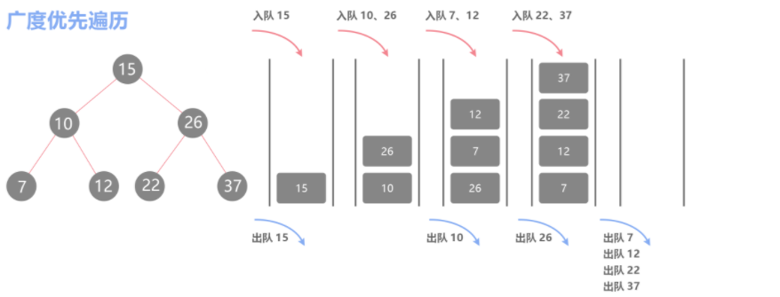

# BFS（广/宽度优先搜索）

## 前置知识：

### **队列**：

	队列是一种特殊的线性表。和栈不同的是，队列只允许在表的一端进行插入操作，而在另一端进行删除操作，遵循先进先出的原则，就如同我们排队打饭一样，先排队的就可以先打到饭。


这里不介绍队列的实现原理，只讲讲STL中队列的应用

    size() 队列中有多少元素
    empty() 判断队列是否为空，为空返回1(true) 否则返回0(false)
    push()  向队尾插入一个元素
    front()  返回队头元素
    back()  返回队尾元素
    pop()  弹出队头元素
写题时，我们可以直接用c++中自带的STL容器

先写头文件，然后声明定义变量，就可以用当中的函数了

先使用#include<queue>

然后queue<数据类型> 变量名;


例如：

```
queue<int> q; //意思就是定义了一个名叫q的队列用于存放int类型的数据
```

同时我们就能使用上面方框中的函数，用.运算符进行调用

我们定义后的队列中是不含有任何元素的

q.size();//这个的结果就会为0     q.empty();//因为咋们队列是空的  所以这个的结果就是为1

我们可以向其中插入数据 ： q.push(2);//这样队列中就会存在一个int类型的数 2

我们也可以多插入些数据 :q.push(5); q.push(1);   //这样队列中的数就是  2  5  1

**队列中插入数据是从队尾插入的  弹出数据是从队头弹出**  

在这个队列中  int a=q.front();//a的结果就是2     int b=q.back();//b的结果就是1

若我们q.pop();  队列中队头元素就出队了，被弹出了   队列中就是 5  1了


这就是一个队列的基本的操作


### 模板类型pair

	pair一般用在map(映射)中   当然我们在用bfs的时候也可以使用pair。

pair<数据类型,数据类型> 变量名  这样就可以建立一个变量，这个变量由两个数据

组成，就和结构体中两个变量一样

例如:

```
pair<int,int> a;
第一个int类型的元素调用：a.first;
第二个int类型的元素调用：a.second;

struct a{
  int x,y;
};
第一个int类型的元素(x)调用：a.x;
第二个int类型的元素(y)调用：a.y;

这两基本可以认为是相同的，如果我们不想用结构体，也可以使用pair
```


我们一般在使用pair时都将其重命名一下

```
typedef pair<int,int> PII; //意思就是之后pair<int,int>都用PII来代替
```

我们就可以这样来定义变量 PII a;这样a就包含了两个变量，可以来分别存横纵坐标

a.first就可以存x   a.second存y


同样我们也可以用PII来定义队列

```
queue<PII>q;
```

同样的 用q.first存x  q.second存y。

##BFS算法及基础模板:

BFS属于一种盲目搜寻法，目的是系统的搜索图中的所有节点去找寻结果。换句话说，它并不考虑结果的可能位置，彻底地搜索整张图，直到找到结果为止。

广度优先的意思是按照树(图)的层级一层层的访问每个节点，在运用广搜算法时，需要使用队列。




BFS的模板大致是如图思路:


那这种思路要如何用代码来实现呢？  我们通过几道例题为大家讲解下BFS算法


### 洛谷 P1141   01迷宫 

#### 题目描述

有一个仅由数字0与1组成的n×n格迷宫。若你位于一格0上，那么你可以移动到相邻4格中的某一格1上，同样若你位于一格1上，那么你可以移动到相邻4格中的某一格0上。

你的任务是：对于给定的迷宫，询问从某一格开始能移动到多少个格子（包含自身）。

#### 输入格式

第1行为两个正整数n,m。

下面n行，每行n个字符，字符只可能是0或者1，字符之间没有空格。

接下来m行，每行2个用空格分隔的正整数i,j，对应了迷宫中第i行第j列的一个格子，询问从这一格开始能移动到多少格。

#### 输出格式

m行，对于每个询问输出相应答案

输入 #1

```
2 2
01
10
1 1
2 2
```

输出 #1

```
4
4
```

**思路：**

这题的意思就是问我们从一个点(x,y)开始，可以移动多少格

假设我们从

		   01
	
		   10

这个图的左上角开始，0的右边下面都是1，满足题目说的条件(0可移动到1，1可移动到0)

所以第一层就是右上角和左下角的1，并且对这两个位置的坐标进行标记，表示这两个点已经搜索过了，再进行一个计数

然后根据右上角和左下角的1进行扩展，我们可以发现右下角和左上角的0都可以被扩展，我们再对其进行标记和计数。

所以我们最终可以得到答案：能移动4格

**参考代码：**

```
#include<iostream>
#include<queue>
using namespace std;

typedef pair<int,int> PII;//pair类型 相当于一个结构体中有两个int类型的变量 用来存坐标
const int N = 1010;//定义常量

int fx[] = {0,0,-1,1} , fy[] = {-1,1,0,0};//偏移量

char h[N][N];//存图 存迷宫 
int st[N][N],sum[N][N];//st:判断是否搜过此点  sum:存结果 
int n,m,x,y,res;//res:步数   x,y:起点

queue<PII> q;//定义一个队列名为q  类型为pair<int,int>类型 
PII r[N];//记录坐标

void bfs(int x,int y)
{
//初始化  q.push({x,y});这样直接入队  c++98是不支持此操作的，所以前面要加数据类型进行一个强制转换
	q.push( (PII){x,y} );
    st[x][y] = 1;
    res = 1;
    int t = 0;
   	
   	while( !q.empty() )
	{	
	    //用个变量存一下当前队头元素坐标  方便后面写
        int t1 = q.front().first , t2 = q.front().second;
        q.pop();//出队
        
        r[t++] = (PII){t1,t2};//记录搜过的点的坐标(t1,t2)
        
        for(int i = 0; i < 4; i++)
		{
            int x1 = t1 + fx[i] , y1 = t2 + fy[i];//遍历当前节点(队列首元素的坐标)的下一层
            if( x1 <= 0 || x1 > n || y1 <= 0 || y1 > n ）continue; //若出界
            if( st[x1][y1] || h[t1][t2] == h[x1][y1] ) continue;//或 与题目条件不符 则跳过这次搜索
            
            st[x1][y1] = 1;//标记此点已被搜过
            res++;//步数增加1
            q.push( (PII){x1,y1} );//将新扩展的元素放入队列的队尾 方便对其下一层的扩展
        }
    }
   
    for(int i = 0;i <= t;i++) sum[r[i].first][r[i].second] = res;//记录下结果步数
}
int main(){
    scanf("%d %d", &n, &m );
    for(int i = 1; i <= n; i++) scanf("%s",h[i] + 1);
    while(m--)
	{
        scanf("%d%d", &x, &y);
        if(!sum[x][y]) bfs(x,y);//如果从x,y的结果为0  表示未从该点开始搜索过 用bfs从该点进行搜索
        printf("%d\n",sum[x][y]);
    }
    return 0;
}
```


### 洛谷P1746 离开中山路

#### 题目描述

爱与愁大神买完东西后，打算坐车离开中山路。现在爱与愁大神在x1,y1处，车站在x2,y2处。现在给出一个n×n（n<=1000）的地图，0表示马路，1表示店铺（不能从店铺穿过），爱与愁大神只能垂直或水平着在马路上行进。爱与愁大神为了节省时间，他要求最短到达目的地距离。你能帮他解决吗？

#### 输入格式

第1行：一个数 n

第2行~第n+1行：整个地图描述（0表示马路，1表示店铺，注意两个数之间没有空格）

第n+2行：四个数 x1,y1,x2,y2

#### 输出格式

只有1行：最短到达目的地距离


输入 #1

```
3
001
101
100
1 1 3 3
```

输出 #1

```
4
```


说明/提示

20%数据：n<=100

100%数据：n<=1000


**参考代码：**

```
#include<iostream>
#include<algorithm>
#include<cstring>
#include<queue>
using namespace std;

typedef pair<int,int> PII;

const int N = 1010;
int h[N][N];
int n;
int n1,n2,m1,m2;
int fx[4] = {-1,0,1,0};
int fy[4] = {0,1,0,-1};
char map[N][N];

int bfs(int x,int y)
{
	h[x][y] = 1;
	queue<PII>q;
	q.push( (PII){x,y} );
	
	while(!q.empty())
	{
		int t1 = q.front().first,t2 = q.front().second;
		q.pop();
		
		for(int i = 0;i < 4;i ++)
		{
			int dx = t1 + fx[i],dy = t2 + fy[i];
			
			if(dx < 1 || dx > n || dy > n || dy < 1) continue;
			if(h[dx][dy] > 0 || map[dx][dy] == '1') continue;

			map[dx][dy] = 1;
			q.push( (PII){dx,dy} );
			h[dx][dy] = h[t1][t2] + 1;
			if(dx == m1 && dy == m2) return h[m1][m2] - 1;
		}
	}
}
int main()
{
	cin >> n;
	memset(h,0,sizeof h);

	for(int i = 1;i <= n;i ++)
	for(int j = 1;j <= n;j ++)
    cin >> map[i][j];
    
	cin >> n1 >> n2 >> m1 >> m2;
	cout << bfs(n1,n2) << endl;
	return 0;
 } 
```


### 洛谷 P1162 填涂颜色

#### 题目描述

由数字0组成的方阵中，有一任意形状闭合圈，闭合圈由数字1构成，围圈时只走上下左右4个方向。现要求把闭合圈内的所有空间都填写成2.例如：6×6的方阵（n=6），涂色前和涂色后的方阵如下：

```
0 0 0 0 0 0
0 0 1 1 1 1
0 1 1 0 0 1
1 1 0 0 0 1
1 0 0 0 0 1
1 1 1 1 1 1

```

```
0 0 0 0 0 0
0 0 1 1 1 1
0 1 1 2 2 1
1 1 2 2 2 1
1 2 2 2 2 1
1 1 1 1 1 1

```

#### 输入格式

每组测试数据第一行一个整数n(1≤n≤30)

接下来n行，由0和1组成的n×n的方阵。

方阵内只有一个闭合圈，圈内至少有一个0。

#### 输出格式

已经填好数字2的完整方阵。


**思路：**

用二维数组来存图

从左上角开始搜索，如果图上位置为0，则对其入队，进行搜索，并将此位置变为1。若当前点碰到1或出界，则停止搜索。在搜索完成后外围的0全部改为了1，只有被1全包围的0不会被搜索到进行改变。

最后我们遍历整个图，若此点为0则改为2。得到最终的图

**参考代码：**

```
#include<iostream>
#include<queue>
using namespace std;
typedef pair<int,int> PII;
int n;
int map[40][40];
int st[40][40],ans[40][40];
int fx[]={-1,0,1,0},fy[]={0,1,0,-1};
queue<PII>q;

void bfs()
{
	q.push((PII){0,0});
	st[0][0]=1;
	
	while(!q.empty())
	{
		for(int i = 0;i < 4;i++)
		{
			int dx=fx[i]+q.front().first,dy=fy[i]+q.front().second;
			if(dx>=0 && dx<=n+1 && dy>=0 && dy<=n+1 && !st[dx][dy] && !map[dx][dy])
			{
				st[dx][dy]=1;
				q.push((PII){dx,dy});
				ans[dx][dy]=1;
			}
		}
		q.pop();
	}
}

int main()
{
	cin>>n;
	for(int i=1;i<=n;i++)
	for(int j=1;j<=n;j++)
	cin >> map[i][j];
	
	bfs();
	
	for(int i=1;i<=n;i++)
	{
		for(int j=1;j<=n;j++)
			if(ans[i][j] == 0 && map[i][j] == 0) cout << 2 << ' ';
			else cout << map[i][j] << ' ';
		cout << endl;
	}
	return 0;
}
```


### 洛谷 P1443 马的遍历 

#### 题目描述

有一个 n×m 的棋盘，在某个点 (x,y) 上有一个马，要求你计算出马到达棋盘上任意一个点最少要走几步。

#### 输入格式

输入只有一行四个整数，分别为 n, m, x, y。

#### 输出格式

一个 n×m 的矩阵，代表马到达某个点最少要走几步（左对齐，宽 5格，不能到达则输出 −1）。


输入 #1

```
3 3 1 1
```

输出 #1

```
0    3    2    
3    -1   1    
2    1    4    
```


**思路：**

模板题，偏移量为马跳的相对位置的横纵截距。从初始点开始广搜，每搜完一次步数+1，并把步数存起来。

最后输出需要走到每个点的步数。

```
#include<iostream>
#include<cstring>
#include<cstdio>
#include<queue>
using namespace std;
typedef pair<int,int> PII;
const int N = 410;
int fx[8] = {-2,-1,1,2,2,1,-1,-2};
int fy[8] = {1,2,2,1,-1,-2,-2,-1};
int n,m,x,y;
int h[N][N];
bool st[N][N];
queue<PII>q;

void bfs()
{
	memset(h,-1,sizeof h);//用于对一个数组进行批量赋值，常常用作数组的初始化方法
    h[x][y] = 0;
	st[x][y] = true;
	q.push((PII){x,y});
	
	while(!q.empty())
	{
		int t1 = q.front().first,t2 = q.front().second;
		q.pop();
		
		for(int i = 0;i < 8;i ++)
		{
			int dx = t1 + fx[i],dy = t2 + fy[i];
			if(dx<1 || dx>n || dy<1 || dy>m || st[dx][dy]) continue;
			st[dx][dy] = true;
			q.push((PII){dx,dy});
			h[dx][dy] = h[t1][t2] + 1;
		}
		
	}
}
int main()
{
	cin >> n >> m >> x >> y;
	
	bfs();
	
	for(int i = 1;i <= n;i ++)
	{
	 	for(int j = 1;j <= m;j ++)
	 		printf("%-5d",h[i][j]);
		printf("\n");
	}
	return 0;
}
```


### 洛谷 P1747 好奇怪的游戏

#### 题目描述

一个游戏类似象棋，但是只有黑白马各一匹，在点x1,y1和x2,y2上。它们得从点x1,y1和x2,y2走到1,1。这个游戏与普通象棋不同的地方是：马可以走“日”，也可以像象走“田”。现在爱与愁大神想知道两匹马到1,1的最少步数，你能帮他解决这个问题么？

#### 输入格式

第1行：两个整数x1，y1

第2行：两个整数x2，y2

#### 输出格式

第1行：黑马到1,1的步数

第2行：白马到1,1的步数


输入 #1

```
12 16
18 10
```

输出 #1

```
8 
9
```


**思路：**

和上一题差不多的思路，只是偏移量改变了点。

```
#include<iostream>
#include<queue>
#include<cstring>
using namespace std;
const int N=110;
int h[N][N];
bool st[N][N];
int n1,n2,m1,m2;
int fx[]={2,-2,2,-2,1,1,-1,-1,2,2,-2,-2};
int fy[]={2,2,-2,-2,2,-2,2,-2,1,-1,1,-1};

struct fxy{
	int x,y;
};

int bfs(int x,int y)
{	
	queue<fxy>q;
	memset(h,0,sizeof h);
	memset(st,false,sizeof st);
	st[x][y] = true;
	q.push( (fxy){x,y} );
	
	while( !q.empty() )
	{
		int t1 = q.front().x,t2 = q.front().y;
		q.pop();
		
		for(int i = 0;i < 12;i ++)
		{
			int dx = t1 + fx[i],dy = t2 + fy[i];
			if(dx<1 || dy<1 || st[dx][dy]==true) continue;
			
			st[dx][dy] = true;
			q.push( (fxy){dx,dy} );
			h[dx][dy] = h[t1][t2] + 1;
			if(dx == 1 && dy == 1) return h[1][1];
		}		
	}
}

int main()
{
	cin >> n1 >> n2 >> m1 >> m2;
	cout << bfs(n1,n2) << endl;
	cout << bfs(m1,m2) << endl; 
	return 0;
}  
```


### AcWing 1097.池塘计数

#### 题目描述

农夫约翰有一片N*M的矩形土地。

最近，由于降水的原因，部分土地被水淹没了。

现在用一个字符矩阵来表示他的土地。

每个单元格内，如果包含雨水，则用‘W’表示，如果不含雨水，则用‘.’表示。

现在，约翰想知道他的土地中形成了多少片池塘。

每组相连的积水单元格集合可以看作是一片池塘。

每个单元格视为与其上、下、左、右、左上、右上、左下、右下八个邻近单元格相连。

请你输出共有多少片池塘，即矩阵中有多少片相连的‘W’块。

#### 输入格式

第一行包含两个整数N和M。

接下来N行，每行包含M个字符，字符为‘W’或'.'，用以表示矩形土地的积水状况，字符之间没有空格。

#### 输出格式

输出一个整数，表示池塘数目。


数据范围

1<=N,M<=1000

输入 #1

10 12

```
W........WW.
.WWW.....WWW
....WW...WW.
.........WW.
.........W..
..W......W..
.W.W.....WW.
W.W.W.....W.
.W.W......W.
..W.......W. 
```

输出 #1

```
3
```


**思路：**

在循环中调用bfs函数，当此点是‘W’且此点未被搜过就从此点开始bfs搜索，并且计数。

搜索时以当前点为中心向八个方向搜索，如果下个点是‘W’，就入队这个点，然后根据此点扩展。

最后输出计数的值即可。

```
#include<iostream>
#include<cstring>
#include<queue>
using namespace std;
typedef pair<int,int> PII;

const int N=1010,M=N*N;

int n,m,cnt;
char g[N][N];
bool st[N][N];
queue<PII>q;

void bfs(int sx,int sy)
{
	q.push( (PII){sx,sy} );
	st[sx][sy] = 1;
	
	while(!q.empty())
	{
		int t1 = q.front().first,t2 = q.front().second;
		q.pop();
		
		for(int i = t1 - 1;i <= t1 + 1;i ++)
		for(int j = t2 - 1;j <= t2 + 1;j ++)
		{
			if(i == t1 && j == t2)continue;
			if(i < 0 || i >= n || j < 0 || j >= m) continue;
			if(g[i][j] == '.' || st[i][j]) continue;
			
			q.push( (PII){i,j} );
			st[i][j] = 1;
		}
	}
}

int main()
{
	cin >> n >> m;
	for(int i = 0;i < n;i ++) cin >> g[i];
	
	for(int i = 0;i < n;i ++)
	for(int j = 0;j < m;j ++)
	if(g[i][j] == 'W' && !st[i][j])
	{
		bfs(i,j);
		cnt ++;
	}
	cout << cnt;
	return 0;
}
```