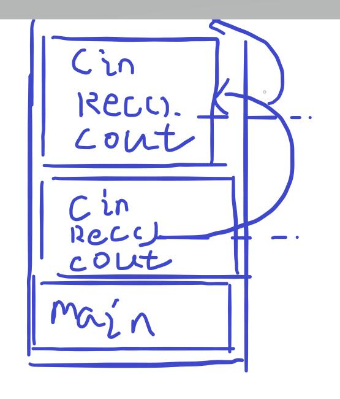

# 算法竞赛入门

> 作为算法&蓝桥杯的入门讲义，会解答竞赛相关概念与基础算法题，以及讲解基础算法。

## 算法基础概念

### 学习算法需要什么

个人观点：大部分算法都是可以通过**分支选择循环函数数组输入输出**实现的。具体而言，只要我们掌握了一门语言的**基础语法**，那么写出一个算法是没有任何问题的。

也就是说学习了语法基础的各位完全可以着手学习算法了。

### 时空复杂度

时空复杂度指**时间复杂度**和**空间复杂度**。它们是衡量我们**算法质量**的重要标准，同时也是算法竞赛中重要考核标准之一。

**时间复杂度**：简单而言指的是我们程序的**运行时间**。在算法竞赛中它更多指的是算法的运行时间，也就是**算法复杂度**。一般而言，蓝桥杯中大部分编程题都要求我们在`1s`的时间内完成，少部分情况是`500ms`，如果某个**测试点运行超时，则不得分**。

**空间复杂度**：指我们程序运行时占用的**内存空间**。假如一个`int`类型的数据占用`1MB`空间，那么`int[256]`就会占用`256MB`空间，如果某个**测试点内存超限，则不得分**。

**算法复杂度**：算法复杂度采用**大O法**表示，有许多算法的复杂度都是被前人证明了的，简单的复杂度计算我们通过程序说明。这里特别强调，我们判断复杂度的根据是**数据范围**，例如某题目指出数据范围是`0 <= n <= 1e8`，那么我们将这个`n`带入下面的循环，会得到`O(n)`复杂度的算法可能会在极限数据超时的结论，这是因为C++一秒能执行的循环次数差不多就是`1e8`左右。

```c++
/* 这里有个运行了n次的循环，那么它的复杂就是O(n) */
for (int i = 0; i <= n; i++);

/* 这里有个二层嵌套的n次循环，那么它的复杂度就是O(n^2) */
for (int i = 0; i <= n; i++) {
    for (int j = 0; j <= n; j++);
}

/* 如果存在多个循环，但不是嵌套关系，那么它们的复杂度也是O(n) */
for (int i = 0; i <= n; i++);
for (int i = 0; i <= n; i++);
for (int i = 0; i <= n; i++);

/* 类似赋值等操作其复杂度可以认为是O(1)的，部分算法的时间复杂度为常数，也可以近似认为是O(1)的 */
int i = 1;
printf("%d", i);

/* 上述是简单的算法复杂度计算，也就是通过循环判断，事实上大部分算法的时间复杂度都是已知的，下面列举一些常用算法的复杂度 */
/*
普通并查集: O(n)
路径压缩并查集: O(logN) 注意，除非特殊说明，否则在大O表示法下的log都是以2为底的
按秩合并并查集: O(logN)
路径压缩 + 按秩合并并查集: O(a函数) 近似为 O(1)

这里枚举了四种并查集算法的复杂度是想告诉大家算法的复杂度是可以通过优化降低的

快速幂: O(logN)
埃氏筛: O(loglogN)
试除法: O(n^1/2)
卡特兰数: O(n)
dfs/bfs: 指数级 这两个算法的复杂度一般都相当高，而且没有固定的计算方法
其它算法...
*/
```

### 推荐OJ

OJ，意为online judge，也就是在线评测平台，是我们刷题必不可少的工具。

1. 洛谷，竞赛题目全，有题解。
2. 力扣，题目针对面试，但不影响，题目解析相当全面，入门学习某个算法事半功倍。
3. Vjudge，各类OJ的聚合，可以在上面找到很多算法书练习题题单。
4. AcWing，课程+练习一体的OJ，推荐学习上面的课程。

### 推荐书籍

自学为主，这里只推荐了书籍资源，大家也可以在B站或者别的平台找视频教程看。

1. 《啊哈！算法》，入门书，知识点讲解简单易懂，缺点是内容太少。
2. 《算法图解》，入门书，图文并茂，简单易懂，缺点是程序用Python2编写。
3. 《大话数据结构》，入门书，用例子解释数据结构，缺点是有部分内容描述错误。
4. 《算法笔记》，进阶书，常用算法和数据结构基本都提到了，介绍了**STL**，缺点是部分内容不详细。
5. 《挑战程序设计竞赛》，进阶书，内容面向ACM，例子丰富，缺点是部分内容蓝桥杯用不到。
6. 《算法（第四版）》，进阶书，内容面向常用算法（没有DP），程序用Java编写。
7. 《算法竞赛入门经典》，进阶书，例子丰富，缺点是难度不止“入门”，需要一定基础。
8. 《算法竞赛进阶指南》，提高书，内容面向NOI，内容全面，缺点是部分内容蓝桥杯用不到。
9. 《数据结构与算法分析：C语言描述》，扩展书。
10. 《算法导论》，扩展书。

## 蓝桥杯赛制讲解

蓝桥杯软件类（Python/C&C++/JAVA B组）的省赛国赛赛制是相同的，故不分开讲解。

### 基本信息

**比赛时间4小时**。比赛形式是上机，一般而言比赛环境会提前配置好，无需手动配置。全程无网络连接，答案通过指定地址提交到服务器。一共十题，包括**五道填空题，五道编程题**，每个题目都有自己的分值。

### 题目类型

#### 填空题

填空题一共五道，**只需要提交答案**即可。不限制解题方式（任意编程语言，任意工具都可以），答案正确才能拿分。

例如：`给定数列，1,3,5...13，求该数列之和。`使用计算器、编写程序都是可以解出来的。

技巧：如果题目考察到了**时间、日期**等需要手动模拟的内容，可以使用**`Excel`**，直接计算。

#### 编程题

编程题一共五道，必须提交**完整的程序代码，且测试点答案正确**才能得分，即使只通过了部分测试点，也可以拿到这些测试点的分数，测试点全部通过则满分。

编程题会限定**算法运行时间、测试数据范围**，也就是前面的时空复杂度，同时会提供若干测试数据。

例如：`给定正整数n，求1~n范围内存在多少个素数，并将这些素数打印出来。 运行时间: 1s 对于30%的测试数据有0 <= n <= 100，对于的60%测试数据有0 <= n <= 1000，对于100%的测试数据有0 <= n < 10000000`。

技巧：如果数据范围很小（如上例60%的数据），但又没法写出正解，可以**使用暴力算法拿到部分分**。

### 评测赛制

蓝桥杯采用的是**OI赛制**，每道题提交之后都**没有任何反馈**，每道题都有**多个测试点**，根据每道题**通过的测试点的数量**获得相应的**分数**。每道题**不限制提交次数**，如果提交错误没有任何惩罚，仅以最后一次提交为准。比赛过程中看不到实时排名，赛后按照总得分来排名。

一句话总结：可无限次提交，答案以最后一次为准，没有错误惩罚，按点计分，比赛中无法获知分数情况，排名根据总分。

### 比赛环境

C/C++组可以使用`Dev C++`或者`Code Block`，推荐使用前者，操作简单。

Java组可以使用`eclipse`或者`IDEA`。

Python组可以使用`IDEL`或者`PyCharm`。

## 模拟算法

今天的课程主要讲解的是“**模拟**”算法，作为各种算法的基石，它并没有明确的定义，其难度上下限都非常高。模拟题考察的是我们的**程序设计能力**，语言基础好，写起来就相对容易。

### 真题

#### 单词分析

[单词分析 - 蓝桥云课 (lanqiao.cn)](https://www.lanqiao.cn/problems/504/learning/)

思路：本题考查C语言基础，我们知道字符本质是`ASCII`码存储的，例如字符`A`对应的`ASCII`码是**65**，依次类推，我们可以得出字符`Z`对应的`ASCII`码为**90**。我们使用一个数组，利用下标统计字符出现次数即可。

```c++
#include <iostream>
using namespace std;
const int N = 26;
int cnt[N];
int main()
{
  char c;
  int ans = -1;
  char ch = ' ';
  // char str[1010];
  // scanf("%s", &str);
  while (cin >> c) cnt[c - 'a']++;
  for (int i = 0; i < N; i++) {
    if (ans < cnt[i]) {
      ans = cnt[i];
      ch = i + 'a';
    }
  }
  cout << ch << endl << ans << endl;
  return 0;
}
```

#### 成绩统计

[成绩统计 - 蓝桥云课 (lanqiao.cn)](https://www.lanqiao.cn/problems/502/learning/)

思路：本题考查C语言基础，相信这种题大家C语言课就做过了。首先我们考虑需不需要将学生成绩存储下来，很明显，不需要，我们在输入的过程中就已经拿到成绩了；接下来我们考虑如何实现**四舍五入**，这里有一个小技巧`%f`之类的输出格式修饰符自带四舍五入功能，舍去的小数点位数会被自动四舍五入；最后`%`的输出需要使用`%%`转义，语法基础。

```c++
#include <iostream>
#include <stdio.h>
using namespace std;
int main()
{
  // 请在此输入您的代码
  int n, s, t;
  // pass great 及格，优秀
  int p = 0, g = 0;
  cin >> n;
  t = n;
  while (n--) {
    cin >> s;
    if (60 <= s && s < 85) p++;
    else if (s >= 85) g++, p++;
  }
  // 计算及格率，优秀率
  printf("%.0f%%\n%.0f%%", (p / (t + .0)) * 100, (g / (t + .0)) * 100);
  return 0;
}
```

#### 回文日期

[回文日期 - 蓝桥云课 (lanqiao.cn)](https://www.lanqiao.cn/problems/498/learning/)

思路：本题考查日期模拟，数字字符串转换。我们将题目的要求分成两部分：

1. 如何推算时间，也就是保证枚举出来的时间是合法的。
2. 如何判断当前日期是否符合答案格式。

针对第一个问题，我们可以将日期划分成`YYYY-MM-DD`的格式，也就是年月日分开，再采用**“进位”**的方式枚举时间，这里注意细节，需要判断闰年。”进位“指的是下面的这种情况`2022-1-31` -> `2022-2-1`。

针对第二个问题，我们可以将**数字转换为字符串**，这是因为作为日期作为数字是没办法补**前导零**的，也就是数字没法表示`01`这种情况。将数字转换为字符串，实际上就是让数字变成它的`ASCII`码表示，也就是`0 -> '0'`，其原理和**单词分析**这一题是一样的。

```c++
#include <iostream>
#include <cstdio>
#include <sstream>
using namespace std;

int dtable[] = {0, 31, 28, 31, 30, 31, 30, 31, 31, 30, 31, 30, 31};

// 日期转字符串
string date2str(int y, int m, int d) {
	string sy, sm, sd;
	stringstream ss;
	ss << y;
	ss >> sy;
	ss.clear();

	ss << m;
	ss >> sm;
	ss.clear();

	ss << d;
	ss >> sd;
	ss.clear();

	if (sm.size() <= 1) sm = "0" + sm;
	if (sd.size() <= 1) sd = "0" + sd;

	return sy + sm + sd;
}

int main() {
	// 请在此输入您的代码
	int y, m, d;
	bool f1 = false, f2 = false;

	scanf("%4d%2d%2d", &y, &m, &d);


	while (!f1 || !f2) {
		// 闰年：四年一闰，百年不闰，四百年又一闰
		// 如果是闰年，则2月会多一天
		if ((y % 4 == 0 && y % 100 != 0) || (y % 400 == 0))
			dtable[2]++;
		// 枚举日期
		while (true) {
			// 当前日不满这月的天数，递增
			// 满了之后月递增
            d++;
            if (d >= datble[m])
			if (d++ >= dtable[m]) m++, d = 1;
			// 满了12月后年递增，二月份天数重新计算，并且重置日月
			if (m > 12) {
				dtable[2] = 28;
				d = 0;
				m = 1;
				y++;
				break;
			}
			string dstr = date2str(y, m, d);
			int l = 0, r = dstr.size() - 1;
			if (!f1) {
				f1 = true;
				while (l < r)
					if (dstr[l++] != dstr[r--]) f1 = false;
				if (f1) cout << dstr << endl;
			}
			
			if (dstr[0] == dstr[2] && dstr[0] == dstr[5] && dstr[0] == dstr[7]
				&& dstr[1] == dstr[3] && dstr[1] == dstr[4] && dstr[1] == dstr[6]) {
					f2 = true;
					cout << dstr << endl;	
				}
			if (f1 && f2) break;
			// ABABBABA

//			cout << date2str(y, m, d) << endl;
//			cout << y << ' ' << m << ' ' << d << endl;
		}

//		break;


	}

	return 0;
}
```

重置代码：

```c++
#include <iostream>
#include <cstdio>
#define endl '\n'
using namespace std;

int dtable[] = {0, 31, 28, 31, 30, 31, 30, 31, 31, 30, 31, 30, 31};
int dat[10];

bool isHuiwen() {
	int l = 1, r = 8;
	while (l < r) if (dat[l++] != dat[r--]) return false;
	return true;
}

bool isAB() {
	return dat[1] == dat[3] && dat[1] == dat[6] && dat[1] == dat[8]
	       && dat[2] == dat[4] && dat[2] == dat[5] && dat[2] == dat[7];
}

void splitDate(int y, int m, int d) {
	for (int i = 4; i >= 1; i--) dat[i] = y % 10, y /= 10;
	dat[5] = m / 10, dat[6] = m % 10;
	dat[7] = d / 10, dat[8] = d % 10;
}

int main() {
	int year, month, day;
	bool f1 = false, f2 = false;

	scanf("%4d%2d%2d", &year, &month, &day);
	day++;

	for (int y = year; ; y++) {
		if ((y % 4 && y % 100 != 0) || (y % 400 == 0)) dtable[2] = 29;
		for (int m = month; m <= 12 ; m++) {
			for (int d = day; d <= dtable[m] ; d++) {
				splitDate(y, m, d);
				if (!f1 && isHuiwen()) {
					f1 = true;
					for (int i = 1; i <= 8; i++) cout << dat[i];
					cout << endl;
				}
				if (!f2 && isAB()) {
					f2 = true;
					for (int i = 1; i <= 8; i++) cout << dat[i];
					cout << endl;
				}
				if (f1 && f2) return 0;
			}
			// 重置当前天数
			day = 1;
		}
		// 新一年重置闰年，当前天数，当前月数
		dtable[2] = 28;
		day = month = 1;
	}
	return 0;
}
```

#### 门牌制作

[门牌制作 - 蓝桥云课 (lanqiao.cn)](https://www.lanqiao.cn/problems/592/learning/)

思路：将数字拆解，例如`1877`就需要1个1，1个8，2个7，那么统计2出现的次数即可。

```c++
#include <iostream>
using namespace std;
int main()
{
  // 请在此输入您的代码
  int cnt = 0;
  for (int i = 1; i <= 2020; i++) {
    int t = i;
    while (t) {
      if (t % 10 == 2) cnt++;
      t /= 10;
    }
  }
  cout << cnt << endl;
  return 0;
}
```

#### 串的处理

[串的处理 - 蓝桥云课 (lanqiao.cn)](https://www.lanqiao.cn/problems/287/learning/)

思路：这个题的处理单位是单词，但单词在题目中的定义是**由 1 个或多个空格分隔**分隔的字符串，于是可以得到三个问题：

1. 如何将多个空格变为一个空格。
2. 如何将首字母大写。
3. 如何将数字与字母间通过下划线分隔。

问题一可以在输入时解决，`C++`的`cin`在读取字符串时会**自动省略空格**，也就是无论有多少个空格都不影响单词输入。同理，`scanf`也具备这个功能。如果我们采用一行输入的方式，会增加工作量。

问题二中的首字母定义是单词的第一个字母，那么我们将输入的字符串看成一个数组`str`，则`str[0]`就是首字母，将小写字符转为大写字符只需要减去它们`ASCII`的差值即可，也就是`'a' - 'A' = 32`，转为小写即`'a' - 32 = 'A'`，这里需要特别判断下，如果当前字母已经是**大写字母或非字母，则不需要转换**。

问题三需要我们遍历字符串，获取每一位的字母。按照字面意思理解，题目的要求似乎是让我们在*字母和数字间插入下划线*，这样做同样会让程序变得更加复杂。实际上我们不需要真正插入下划线，只需要在**前一位是字母，当前位是数字**以及**前一位是数字，当前一位是字母**的情况下**输出下划线**即可。将情况细分，我们还可以将当前只有一个数字和当前有多个数字的情况分开讨论，例如`a1a`是当前只有一个数字的情况，`h123g`，是当前存在多个数字的情况，对于前者，可以特殊判断；后者则按照规则处理，而中间的数字原样打印。

```c++
#include <iostream>
#include <cstdio>
using namespace std;

// 一位数字：前后都是字母，直接输出_数字_
// 多位数字：左边是字母，输出_数字，右边是字母，输出数字_，中间数字原样输出

// 判断当前字符是否是字母
bool isAlpha(char c) {
  return 'a' <= c && c <= 'z' || 'A' <= c && c <= 'Z';
}

int main()
{
  // 请在此输入您的代码
  string str;
  while (cin >> str) {
    // 针对小写字符首字母大写
    if ('a' <= str[0] && str[0] <= 'z') str[0] -= 32;
    int sLen = str.size();
    for (int i = 0; i < sLen; i++) {
      // 枚举数字位置的几种情况
      if (!isAlpha(str[i])) {
        // 如果是h1h这种类型的情况，输出h_1_h
        if (isAlpha(str[i - 1]) && isAlpha(str[i + 1])) cout << "_" << str[i] << "_";
        // 如果是h123这种情况，输出h_1
        else if (i >= 1 && isAlpha(str[i - 1])) cout << "_" << str[i];
        // 如果是123h这种情况，输入3_h
        else if (i < sLen - 1 && isAlpha(str[i + 1])) cout << str[i] << "_";
        // 中间字符原样输出
        else cout << str[i];
      } else cout << str[i]; // 字母原样输出
    }
    cout << ' ';
  }
  return 0;
}
```

## 递归

> 基础递归算法讲解
>
> *2022年1月5日22:18:34*

### 什么是递归

简单来说，**函数调用自身就是递归**。

```c++
#include <iostream>
using namespace std;

void rec() {
    cout << "递归..." << endl;
    rec();
}

int main() {
    rec();
    return 0;
}
```

如果你执行上面的代码，最有可能看到的不断打印的`递归...`。原因很简单，我们没有设置**递归终止的条件**。上面的代码就和`while (true)`循环一样，会不断执行下去。现在，我们使用一个全局变量`i`记录当前`rec`函数被调用的次数，只有当`i < 10`时才进行递归。运行下面的代码，会发现这次只打印了若干个`递归...`，而终止递归的判断`if (i < 10)`就是递归终止的条件。

```c++
#include <iostream>
using namespace std;

int i = 0;

void rec() {
    cout << "递归..." << endl;
    // 递归终止条件
    if (i < 10) {
    	i++;
        rec();
    }
}

int main() {
    rec();
    return 0;
}
```

### 递归的运作机制

在解释递归的运作机制前，我们先考虑这样的一个问题：不使用数组、指针、string，只允许使用一个字符型变量，如何逆序打印输入的字符（输入字符`*`停止输入）？例如输入`abcd`打印`dcba`。

答案是使用递归。

```c++
#include <iostream>
using namespace std;

void rec() {
	char ch;
    cin >> ch;
	if (ch == '*') return;
    rec();
    cout << ch;
}

int main() {
    rec();
    return 0;
}
```

为什么递归可以实现这个功能呢？原因是因为我们在调用函数时会用到一个叫**栈**的数据结构，栈的基本特征就是**先进后出**(FILO)。在栈中有两个基本操作，**压入和弹出**，压入即将新元素添加到栈中，弹出即将栈顶元素弹出。这个过程就类似于放碟子，最后放上去的碟子一定会被最先拿到，最先放上去的碟子一定是最后拿到。

下图解释了程序调用过程中系统栈的情况，可以发现`main`函数永远是第一个调用，最后一个弹出的。



**当某个函数被压入栈中又没有被弹出时，其内部的变量都会不会被销毁**，这也是递归的一个非常重要的特性，**递归可以保留变量状态**。在上图中，`rec()`函数在执行到`cout`输出语句之前，再次调用了自己，因此会压入一个新的`rec()`函数，而接下来还没执行到的代码也会被暂停执行。如果此时我们输入`*`，则顶层`rec()`函数会调用`return`语句，此时它就会被弹出系统栈，这时就会继续执行刚才没有执行完的`cout`语句。以此类推我们还能发现，递归本身就是一个**”从尾到头“**执行的过程。

### 递归的作用

依然是上面的逆序打印字符的问题，如果这次允许使用数组，我们很容易就能写出一个循环将其打印出来。递归的作用与循环是类似的，它也是用来**处理重复的问题**的，甚至在有些情况下，两者可以互相转化。区别在于循环一般用来解决**递推**问题，而递归因为其从尾到头的特性，常用来解决**递归**问题。

那么什么是递推问题，什么是递归问题呢？实际上它们的区别就在于思考的出发点不同。递推一般是从`0...n`的思考过程，而递归则相反是从`n...0`的思考过程。举个例子，我们要求`0~100`间数字的和，它可以用下面的代码完成。

```c++
// 递推：它的过程是这样的0 + 1 + 2 + 3...，也就是从初始情况出发，正推到答案
int s = 0;
for (int i = 0; i <= 100; i++) s += i;

// 递归的过程则是反过来的，假设我们有一个函数fn，我们设fn(n)为答案，那么fn(n) = fn(n - 1) + n
// 也就有fn(100) = fn(99) + 100, fn(99) = fn(98) + 99 ... fn(1) = fn(0) + 1
// 这个就是递归的思考过程，也就是从答案出发，倒推到初始情况
int fn(int n) {
	if (n == 0) return 0;
	return fn(n - 1) + n;
}
```

当然，在赛场上单纯的使用上面形式的递归是没法帮助我们解题的，原因就和前文提到的一样，上面形式的递归可以被循环代替，但常用的递归算法，例如`DFS`却是高频考点之一。理解递归是学会`DFS`的基础。

### 理解递归

在讲解如何分析递归之前，首先强调：**理解递归不是理解递归算法的运行过程，而是理解如何分析**。

在本人看来，通过打印递归运过程中的数据或模拟递归执行过程，都是没法帮助我们理解递归的，反而会适得其反，因为递归的运行过程并不是类似循环一般“线性”的，而是具有“跳跃性”的。

为了方便理解，下面将递归分成两种情况，一种是“单层递归”，一种是“多层递归”，它们的表现形式可以参考下面的代码。

```c++
// 单层递归：类似于上面的逆序打印字符串，可以看到只有一次递归调用
void rec() {
	// ...
    return rec();
}

// 多层递归，有多次递归调用，这也是回溯和DFS等算法的核心
// 第一种：DFS常用写法，通过多次调用枚举全部情况
void rec(n) {
    // ...
    rec(n - 1);
    rec(n - 2);
	rec(n - 3);
    rec(n - 4);
}

// 第二种：回溯常用写法，使用for循环多次调用，其本质和DFS是一样的
// 区别在于它可以设置循环参数的初始值
void rec(n) {
    // ...
    for (int i = 1; i <= 4; i++) {
        rec(n - i);
    }
}
```

#### 单层递归

在前文中我们提到了倒序打印字符串这个例子，它就是一个典型的单层递归。单层递归的运行过程就是上图中栈的运行过程。利用这个特性我们可以完成字符串翻转等功能，这里不再过多解释。

#### 多层递归

要理解多层递归，使用栈表示递归过程就是不够的了，这里引入一个新的数据结构，**树**。树是最常用的数据结构之一，二叉树、二叉搜索树、平衡树、线段树等等都是树的不同表现形式。在这里我们并不详细解释树的相关概念，因为我们只是用到了树来表示递归的执行过程，并不是用树解决某个问题。在下面的例图中，如果没有特别强调则都可以认为是一颗树。

##### 递归树

**递归过程可视化**：[数据结构和算法动态可视化 (Chinese) - VisuAlgo](https://visualgo.net/zh)

我们先从一个最简单的例子开始：斐波那契数列问题。

[509. 斐波那契数 - 力扣（LeetCode） (leetcode-cn.com)](https://leetcode-cn.com/problems/fibonacci-number/)


斐波那契数列问题可以使用递推解决，也可以使用递归解决，这里主要讲解后者。

上面的图片就是斐波那契数列的公式，我们使用递归将其表达出来就是下面的代码：

```c++
#include <iostream>
using namespace std;

typedef long long LL;
LL fib(int n) {
	if (n <= 2) return 1;
	return fib(n - 1) + fib(n - 2);
}

int main() {
	cout << fib(9);
	return 0;
}
```

虽然上面的代码看起来非常简单，但如果你尝试通过代码理解也是很难办到的。就和单层递归可以用栈分析一样，多层递归也可以用**递归树**分析。

递归树是指将递归的过程使用树描述。下图是当`n = 6`的情况下斐波那契数列的递归树。可以看到图中的是一颗二叉树，这实际上对应着我们有两层递归，也就是递归层数`n`对应了我们递归树是`n叉树`。


### 例题

#### 爬楼梯

[70. 爬楼梯 - 力扣（LeetCode） (leetcode-cn.com)](https://leetcode-cn.com/problems/climbing-stairs/)

思路：这个问题实际上就是斐波那契数列问题，代码略。

#### P1427 小鱼的数字游戏

[P1427 小鱼的数字游戏 - 洛谷 | 计算机科学教育新生态 (luogu.com.cn)](https://www.luogu.com.cn/problem/P1427)

思路：这个题就是上面提到的逆序输出字符串问题，建议大家自己实现。

#### P1657 选书

[P1657 选书 - 洛谷 | 计算机科学教育新生态 (luogu.com.cn)](https://www.luogu.com.cn/problem/P1657)

提示：这个题的递归树节点可以使用`(x, 1)、(x, 2)`表示，意思是第x个人选了第一本书还是第二本数。这种模型在后面的`回溯/DFS`章节非常重要。

思路：我们可以将所有书看成是一个序列，对于这个序列上的每个数字，都有选和不选两种状态，如果选了，则该数不可继续使用，当所有人都有书时，说明存在一个可行的分配方案；如果不选，则要将书的状态还原为未选择。

```c++
#include <iostream>
using namespace std;

const int N = 30;
int book[N][3];
bool used[N];
int ans = 0;

void dfs(int n) {
	if (n <= 0) {
		ans++;
		return;
	}

	for (int k = 1; k <= 2; k++) {
		if (!used[book[n][k]]) {
			used[book[n][k]] = true;
			dfs(n - 1);
			used[book[n][k]] = false;
		}
	}

//	if (!used[book[n][1]]) {
//		used[book[n][1]] = true;
//		dfs(n - 1);
//		used[book[n][1]] = false;
//	}
//
//	if (!used[book[n][2]]) {
//		used[book[n][2]] = true;
//		dfs(n - 1);
//		used[book[n][2]] = false;
//	if (!book[n][2]) dfs(n - 1, 2);
}

int main() {
	int x;
	cin >> x;
	if (x <= 0) {
		cout << 0 << endl;
		return 0;
	}
	for (int i = 1; i <= x; i++) cin >> book[i][1] >> book[i][2];
	dfs(x);
	cout << ans << endl;
	return 0;
}
```

## 排序

> 排序可以帮助我们将序列变为递增或递减状态，辅助其它算法
>
> *2022年1月13日17:50:28*

排序算法一般不会单独考，这是因为`C++`提供了排序的相关函数，它一般会作为其它算法的辅助算法考察，例如二分查找、模拟等算法。也有的题目会要求答案按顺序输出（字典序，但一般在处理过程中就可以保证），这时同样需要使用排序算法。

### 排序算法

排序算法有很多种，下面简单的介绍一些常用算法。

#### STL排序

`C++`的`STL`中提供了`sort`函数，使用该函数能很方便的对数组或容器进行排序，这也是我们竞赛中使用的最多的一种排序方式。下面简单介绍下`sort`函数的使用。

`sort`函数被包含在`algorithm`头文件中，该头文件中也提供了一些其它常用算法，例如全排列、二分查找等。它提供多种调用形式（`C++`中的重载），主要区别在于参数列表的不同，这里介绍三种情况。

1. 传入**起始引用,未尾引用**，这种用法即针对这个范围内的数据进行排序。
2. 传入**起始引用,未尾引用,自定义排序函数**，`sort`函数默认是升序排序的，如果我们想改变其排序规则，就可以传入自定义排序函数。
3. **传入起始引用,末尾引用**，但传入数据类型是**结构体**，这种情况就需要**重载操作符**了。事实上`C++`中大部分数据类型，例如`int/char/string`等都是自带排序规则的，因此我们才不需要重载操作符或者自定义排序规则，但类似用户自定义的结构体，默认是没有排序规则的，因此传入进去后`sort`无法根据排序规则进行排序，此时就会报错。

补充：类似`set/map/priority_queue`等自带排序的容器，如果提供的数据类型没有排序规则，同样会报错。

`sort`函数内部采用的是混合排序，其时间复杂度是`nlog(n)`，空间复杂度为`O(1)`。

```c++
#include <iostream>
// sort函数被包含在此头文件中
#include <algorithm>
#include <vector>
using namespace std;

bool cmp(int a, int b) { return a > b; }

struct Node {
	int x;
    // 重载排序操作符
	bool operator< (Node n) const {
		return n.x < x;
	}
};

int main() {
	int arr[6] = { 4, 24, 1, 6, 5, 13 };
    vector<int > vec = {9, 6, 3, 8, 5, 2, 7, 4, 1, 0};
	Node ns[3];
	for (int i = 0; i < 3; i++) ns[i].x = i;
    // 传入起始和末尾引用，会将这个区间内的数进行排序
	sort(arr, arr + 6);
    // 对容器进行排序
    sort(vec.begin(), vec.end());
	for (int i = 0; i < 6; i++) cout << arr[i] << ' ';
	cout << endl;
	
	// 自定义排序规则，降序排序 
	sort(arr, arr + 6, cmp);
    for (int i = 0; i < 6; i++) cout << arr[i] << ' ';
    cout << endl;
    
    // 传入结构体，需要重载排序操作符 
    sort(ns, ns + 3);
    
	return 0;
}
```

#### 快速排序

快速排序算法是“分治”思想的经典应用

#### 归并排序

#### 堆排序

#### 桶排序

#### 冒泡排序


